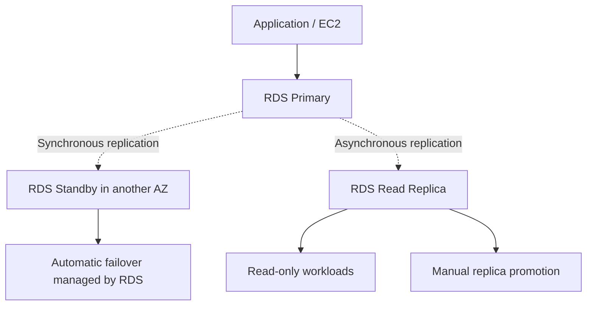

# RDS HA and Read Scaling Architecture

- The primary handles normal reads and writes.
- The standby supports high availability and is not a normal read endpoint.
- Multi-AZ standby replication is synchronous and managed by RDS.
- A Read Replica receives changes asynchronously and can serve read traffic.
- A Read Replica can be promoted into an independent database.
